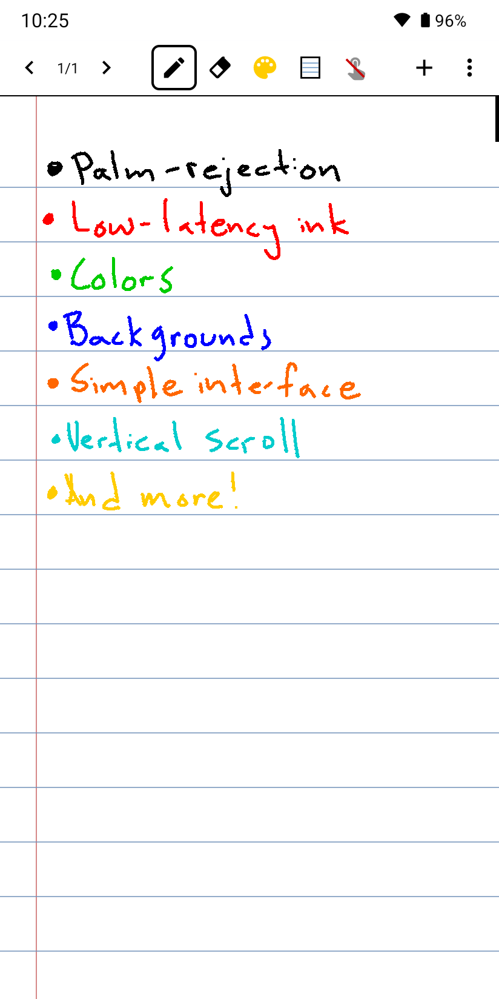

<p align="center">
  
</p>

# inkit

A simple, fast note-taking app for Android with an eye toward bullet journaling. inkit is designed to be used with [Bigme](https://bigme.vn/) and [Boox](https://shop.boox.com/) e-ink devices, and built on top of [inksdk](https://github.com/imedwei/inksdk) for low-latency stylus input. The active controller is auto-detected at startup — Bigme firmware uses the `HandwrittenClient` daemon, Boox firmware uses Onyx's `TouchHelper`, and other Android devices fall back to the standard `MotionEvent` + `Canvas` path.

Special thanks to [imedwei/inksdk](https://github.com/imedwei/inksdk) for the underlying low-latency ink library that makes this possible.

## Philosophy

inkit aims to stay out of your way:

- **Simple** — pen, eraser, page nav. Nothing else to learn.
- **Fast** — low-latency stylus input via inksdk's vendor-specific ink controllers.
- **Bullet-journal friendly** — quick page creation and navigation for daily logs, collections, and rapid logging.
- **E-ink first** — designed and tuned for Bigme and Boox devices, with fallback support for other Android tablets.

## Features

- **Pen / finger differentiation** — uses `MotionEvent.getToolType()` to distinguish stylus from finger.
- **Toggle finger touch** — disable finger drawing while pen input remains active, so you can rest your hand on the screen.
- **Low-latency ink** — leverages vendor-specific ink controllers for pen input.
- **Touch-through buttons** — control buttons remain tappable even when finger touch is disabled on the canvas.
- **Multi-page canvas** — flip between pages for journaling-style workflows.

## Screenshots

<p align="center">
  
</p>

## Building

### Prerequisites

1. **Android SDK** (API level 34 or higher)
2. **Java 17+** (JDK)
3. Set `ANDROID_HOME` environment variable pointing to your SDK

### Setup

```bash
git clone <repo-url>
cd inkit

export ANDROID_HOME=/path/to/android-sdk

./gradlew assembleDebug
```

The APK will be at: `app/build/outputs/apk/debug/app-debug.apk`

## Migrating from a pre-1.0.8 build (preserve your notes)

Releases before 1.0.8 were unsigned debug builds with a per-CI-run keystore. Starting with 1.0.8 the release APK is signed with a permanent key, so future updates apply in place — but the *first* upgrade can't run on top of an older install because the signing certificates differ.

To carry your notes across the transition:

1. **Install the matching debug APK** — every GitHub release now ships both `app-release.apk` and `app-debug.apk`. Install the debug build over your current install (or build locally with `./gradlew assembleDebug` and `adb install -r app/build/outputs/apk/debug/app-debug.apk`). Debug builds remain compatible with previously-installed debug builds when the same debug keystore is used. If your existing install was built locally on this machine, the local debug APK will install over it; if it came from CI, see "Stable debug keystore" below.
2. **Export your notes** — open the app, tap the **More** menu, choose **Export notes…**, and save the zip somewhere outside the app sandbox (e.g. `Downloads`).
3. **Uninstall and install the release** — uninstall the old app, install `app-release.apk` via Obtainium (or sideload).
4. **Import** — open the new release build, **More → Import notes…**, pick the zip you exported.

From this point on, every `app-release.apk` from CI is signed with the same key, so Obtainium updates apply cleanly without ever asking to uninstall.

### Stable debug keystore (optional)

If you want CI debug builds to be update-compatible with each other, base64-encode your `~/.android/debug.keystore` and add it as a `DEBUG_KEYSTORE_BASE64` repo secret. The workflow places it at `~/.android/debug.keystore` on the runner before `assembleDebug`. Without this secret, each CI debug APK is signed with a fresh random keystore and won't install over a previous CI debug build.

## Usage

1. **Draw with stylus** — always works (pen input bypasses the finger touch toggle).
2. **Draw with finger** — works when touch is enabled.
3. **Toggle button** — enables/disables finger touch on the canvas.
4. **Pen / eraser / clear** — switch tools or wipe the current page.
5. **Prev / next / new** — navigate or add pages.

## Project Structure

```
app/
├── src/main/java/com/merrythieves/inkit/
│   ├── MainActivity.kt      # Activity with toolbar and page controls
│   ├── InkSurfaceView.kt    # Custom SurfaceView with pen/finger differentiation
│   ├── CanvasStore.kt       # Page persistence
│   └── InkitApp.kt          # Application class
├── src/main/res/layout/activity_main.xml
└── build.gradle.kts
inksdk/                       # Embedded inksdk library (https://github.com/imedwei/inksdk)
└── src/main/java/com/inksdk/ink/
    ├── InkController.kt     # Interface for ink controllers
    ├── BigmeInkController.kt
    ├── OnyxInkController.kt
    └── NoopInkController.kt
```

## How it Works

### Input Differentiation

```kotlin
private fun isPenInput(event: MotionEvent): Boolean {
    val toolType = event.getToolType(0)
    return toolType == MotionEvent.TOOL_TYPE_STYLUS ||
           toolType == MotionEvent.TOOL_TYPE_ERASER
}

private fun isFingerInput(event: MotionEvent): Boolean {
    val toolType = event.getToolType(0)
    return toolType == MotionEvent.TOOL_TYPE_FINGER ||
           toolType == MotionEvent.TOOL_TYPE_MOUSE
}
```

### Touch Event Handling

1. **Pen input** — always handled (bypasses the touchEnabled flag).
2. **Finger input** — only handled if `touchEnabled = true`.
3. When finger touch is disabled, `onTouchEvent` returns `false`, allowing events to bubble up to parent views (buttons can still be clicked).

## Architecture Notes

- Uses the `InkController` interface for vendor abstraction.
- Supports Bigme (via `HandwrittenClient`), Boox / Onyx (via `TouchHelper`), and a fallback (standard `MotionEvent` path).
- Controller selection is automatic: `InkControllerFactory` picks Bigme when `Build.MANUFACTURER == "Bigme"`, otherwise instantiates the Onyx controller — whose `attach()` succeeds on Boox firmware and fails cleanly elsewhere, dropping the host onto the `MotionEvent` fallback. No user-facing toggle is required.
- Ink is mirrored to a bitmap for compatibility with system UI composes.
- Onyx `TouchHelper` owns the surface during raw drawing; the host suspends the controller around `holder.lockCanvas()` calls to avoid surface-lock deadlocks. Bigme paints to a separate ION buffer and needs no such suspension.

## Acknowledgements

Huge thanks to [@imedwei](https://github.com/imedwei) and the [inksdk](https://github.com/imedwei/inksdk) project — inkit would not exist without it.

## License

Apache 2.0 (same as inksdk)
